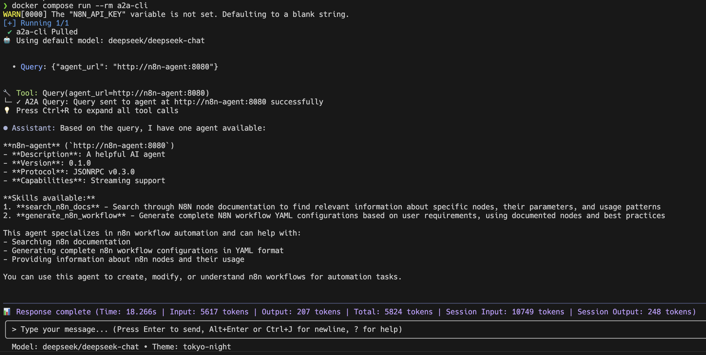

# Workflows Creator

An advanced example demonstrating how to dynamically create n8n workflows using AI and deploy them to your n8n instance.

## Table of Contents

- [🎯 What You'll Learn](#-what-youll-learn)


## 🎯 What You'll Learn

- How to create workflows from a single prompt using the A2A protocol
- How to sync the generated workflow to your n8n instance

## 🚀 Getting Started

1. First we will create a `.env` file based on the `.env.example` file:

   ```bash
   cp .env.example .env
   ```

2. Next, fill in the required environment variables in the `.env` file, including your API keys for the AI providers you intend to use.

3. Start the services using Docker Compose:

   ```bash
   docker compose up -d
   ```

4. Visit the local n8n instance and create a dummy account. It's all local so you can enter whatever you like (Not sure why there is no environment variable just to skip this authentication form - seems to be required so just signup with dummy data):

    ```
    open http://localhost:5678/
    ```

5. Create an n8n API key from the user settings page and add it to your `.env` file as `N8N_API_KEY`.

6. Now that n8n is properly setup, let's continue with the workflows-creator setup. Let's enter the `a2a-cli` container:

   ```bash
   docker compose run --rm a2a-cli
   ```

You should see a chat prompt. Ask it what agents does it have available or just type /a2a to list them:


